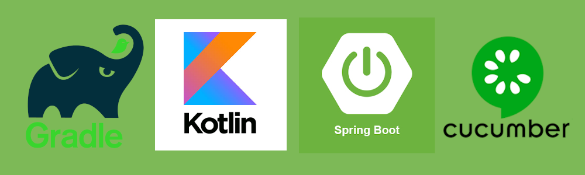

 # Spring Boot 2 - Kotlin Template




## Spring Boot Quickstart 
 
This is a Gradle template for Spring Boot web applications in Kotlin 
which has all common standards on place ready for development

- Kotlin 
- Gradle 3.5+
- Spring boot 2.1.13.RELEASE 
- JPA with H2 for test
- Swagger 2 API documentation 
- Cucumber and Spring Boot test for acceptance test
- Mapstruct integration  

## Getting Started

This template application is ready to connect to a MySQL database. To run locally you can easily deploy a docker container 
with the following command. 

```bash
docker volume create mysql-data

docker run --name mysql  \
           -d \
           --mount src=mysql-data,dst=/var/lib/mysql        \
           -e MYSQL_ROOT_HOST=%          \
           -e MYSQL_ROOT_PASSWORD=root   \
           -e MYSQL_USER=root            \
           -e MYSQL_PASS=root            \
           -p 3306:3306                  \
           mysql/mysql-server:latest

docker start mysql
```

After that you can compile and run unit & acceptance test with :

```sh 
$ gradle clean build
```

Finally, you can easily run locally with:

```sh 
$ gradle bootRun
```

Check API Swagger documentation in the browser with:

```
http://localhost:5000/swagger-ui.html
```
